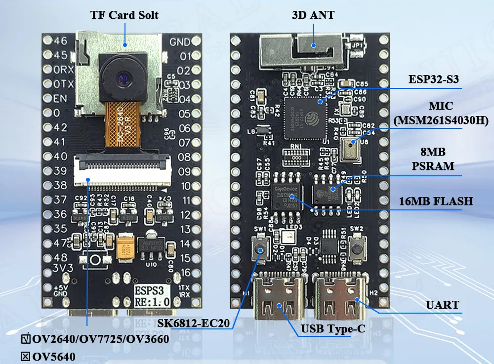
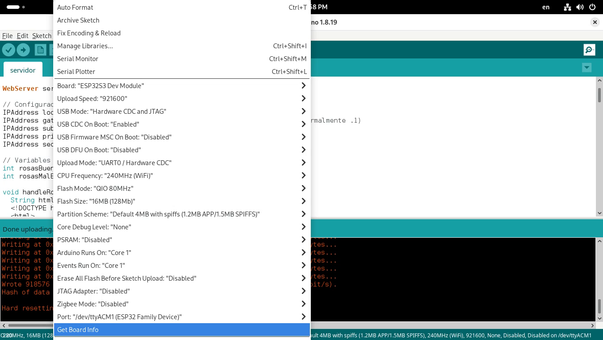
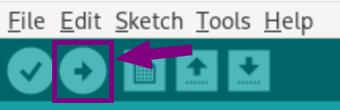
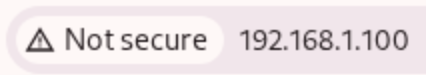
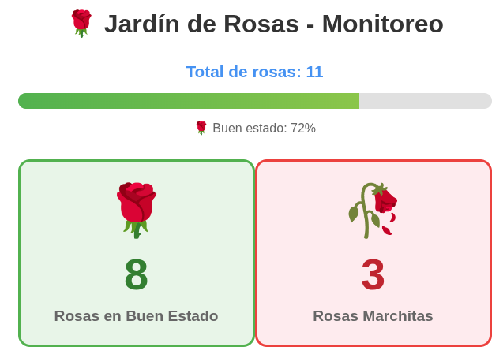

# ESP32 S3 CAM


# Arduino
## a. Configuración
1. Ir a: File/Preferences
    * Additional Boards Manager URLs: https://espressif.github.io/arduino-esp32/package_esp32_index.json
2. Ir a: Tools
   	```make
    Board               : ESP32S3 Dev Module
    USB Mode            : Hardware CDC and JTAG
    USB CDC On Boot     : Enabled
    Flash Mode          : QIO 80MHz
    Flash Size          : 16M (128Mb)
    PSRAM               : Disabled
    Partition Scheme    : Default 4MB with spiffs (1.2MB APP/1.5MB SPIFFS)
	``` 
    
## b. Código : codigo.ino
```[c++]
// Configuración WiFi
const char* ssid = "ssid_wifi";
const char* password = "password_wifi";

// Configuración IP estática
IPAddress local_IP(192, 168, 1, 100);    // IP estática que quieres asignar
IPAddress gateway(192, 168, 1, 1);       // Puerta de enlace de tu router (normalmente .1)
IPAddress subnet(255, 255, 255, 0);      // Máscara de subred típica
IPAddress primaryDNS(8, 8, 8, 8);        // DNS primario (Google)
IPAddress secondaryDNS(8, 8, 4, 4);      // DNS secundario (Google)
```
## c. Cargar código a Arduino


# Navegador: Visualizar interfaz web
1. Colocar la IP del servidor en el navegador
    
2. Se observa la interfaz web
    
